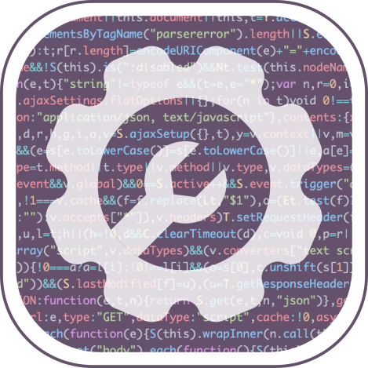
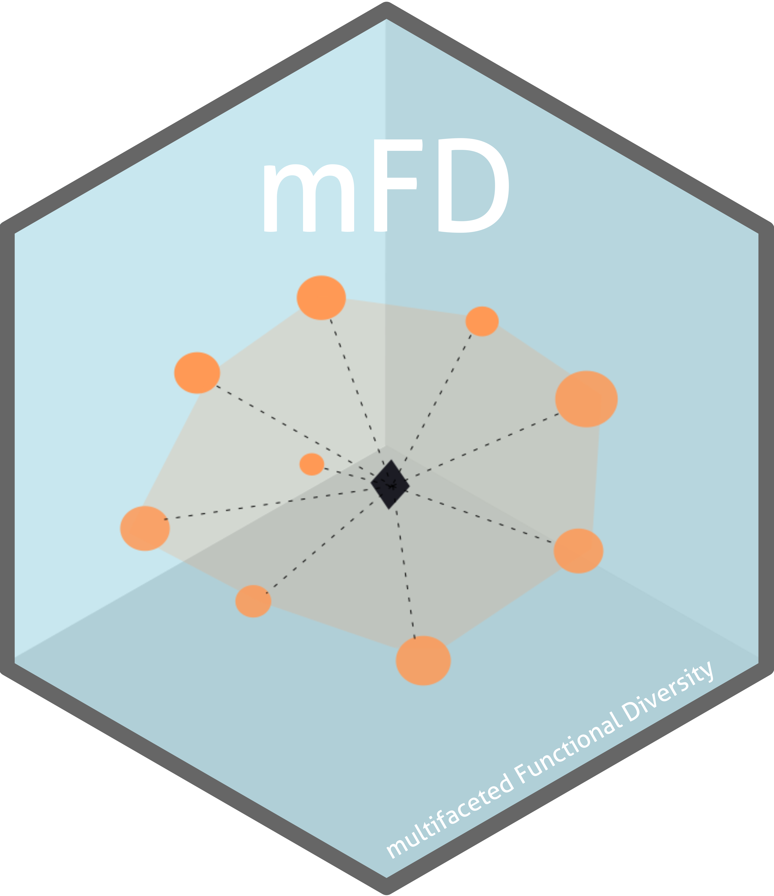

```{r setup, include=FALSE}
knitr::opts_chunk$set(echo = FALSE)
```


## Ongoing {.ongoing}

<!-- Reproducible research -->

<div>

<div style="float: left;width: 30%;margin-right: 5%;">
<a href="https://rdatatoolbox.github.io/">
{width=100%}
</a>
</div>

### Reproducible research with R

Since 2019&nbsp; • &nbsp;Co-organised with the [GdR EcoStat](https://sites.google.com/site/gdrecostat/)
<br/>
_A five-day training course on reproducibility, software development and version 
management tools (Research compendium, Git, GitHub, R Markdown, Quarto, renv, Docker)_

</div>

**`Website:`** <https://rdatatoolbox.github.io/>
<br/>
**`GitHub: `** <https://github.com/rdatatoolbox/>

<br/>


<!-- Theory-driven -->

<div>

<div style="float: left;width: 30%;margin-right: 5%;">
<a href="https://theodatasci.github.io/">
{width=100%}
</a>
</div>

### Theory-driven analysis of ecological data

Since 2022&nbsp; • &nbsp;Co-organised with the [GdR TheoMoDive](https://sete-moulis-cnrs.fr/en/research/centre-for-biodiversity-theory-and-modelling/theomodive)
<br/>
_A five-day training course on mathematical modelling (differential equations, Lotka Volterra, Jacobian matrices), and the statistical links between models and data._

</div>

**`Website:`** <https://theodatasci.github.io/>
<br/>
**`GitHub: `** <https://github.com/theodatasci/>

<br/>


<!-- Literature synthesis -->

<div>

<div style="float: left;width: 30%;margin-right: 5%;">
<a href="https://literaturesynthesis.github.io/">
{width=100%}
</a>
</div>

### Meta-analyses & Systematic reviews

Since 2022&nbsp; • &nbsp;Co-organised with the [UMS PatriNat](https://www.patrinat.fr)
<br/>
_A five-day training course on methods and techniques of meta-analyses and systematic reviews/maps applied to the field of biodiversity._

</div>

**`Website:`** <https://literaturesynthesis.github.io/>
<br/>
**`GitHub: `** <https://github.com/literaturesynthesis/>

<br/>


## Coming soon {.coming-soon}


<!-- Networks Analysis -->

<div>

<div style="float: left;width: 30%;margin-right: 5%;">
{width=100%}
</div>

### Networks Analysis

Planned in 2024

</div>

<br/>


<!-- IA & Biodiversity -->

<div>

<div style="float: left;width: 30%;margin-right: 5%;">
{width=100%}
</div>

### Artificial Intelligence & Biodiversity

Planned in 2024

</div>


<br/>


## Finished {.finished}


<!-- Reproducible research -->

<div>

<div style="float: left;width: 30%;margin-right: 5%;">
<a href="https://frbcesab.github.io/workshop-free">
{width=100%}
</a>
</div>


### Functional rarity and diversity in ecology

2022 &#183; Co-organised with the working group [FREE](https://www.fondationbiodiversite.fr/en/the-frb-in-action/programs-and-projects/le-cesab/free/)
<br/>
_A four-hour training course on functional rarity and diversity in ecology 
using the R packages [`mFD`](https://github.com/CmlMagneville/mFD) and 
[`funrar`](https://github.com/rekyt/funrar)._

</div>

**Official website:** <https://frbcesab.github.io/workshop-free/>


## Corrections {.appendix}


If you see mistakes or want to suggest changes, please 
[Create an issue](https://github.com/frbcesab/training-courses/issues)
on the source repository.


## Reuse {.appendix}


The material of this website is licensed under Creative Commons Attribution 
[CC BY 4.0](https://creativecommons.org/licenses/by/4.0/).
Source code is available at https://github.com/frbcesab/training-courses/.
